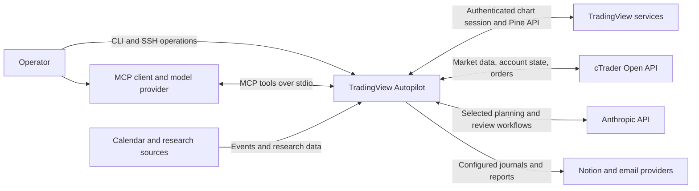
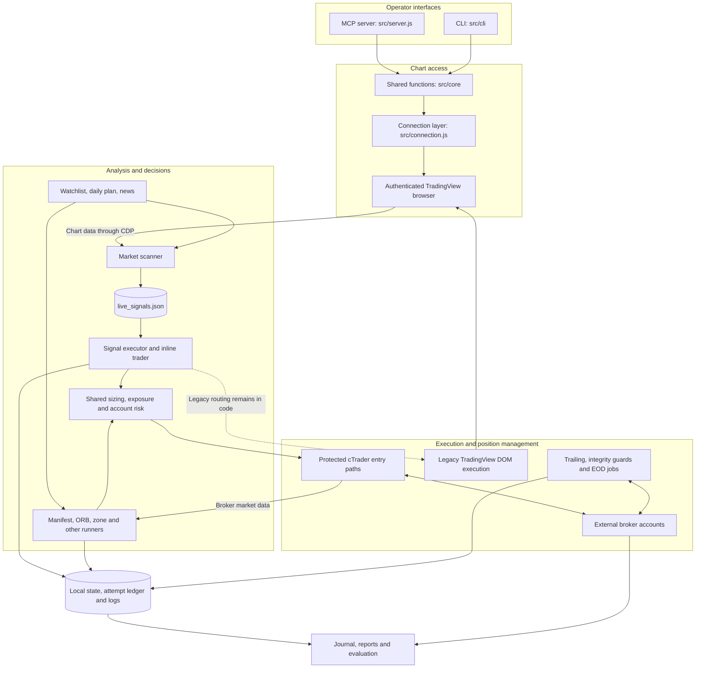
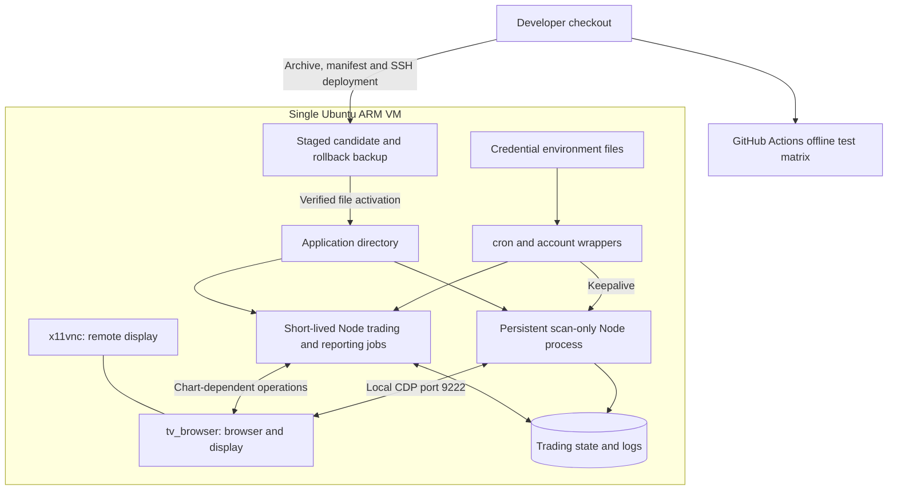

# Solution architecture: TradingView Autopilot

**Baseline:** application commit `9debe07`, deployed and checked on 19 September 2026, with the subsequent cTrader integration cleanup reflected below. This document describes the implemented system and the VM observed during that deployment. Sections explicitly marked **proposed** are design recommendations, not deployed capabilities. Schedules and runtime configuration can change independently of source control.

## 1. Purpose and scope

The solution supports chart analysis, strategy research, signal generation, automated broker execution, position management, and reporting. It exposes TradingView chart functions to an MCP client and a CLI, while scheduled trading processes operate independently of the MCP server.

The architectural priorities are to reject new entries when required risk information is unavailable, preserve evidence of execution attempts, keep position protection separate from entry decisions, and attribute trades to their originating strategy.

The current design is a **modular Node.js application deployed as multiple processes on one Ubuntu VM**. Components communicate through function calls, broker APIs, and local files. There is no central database, message broker, or highly available execution cluster.

## 2. System context



External integrations are used only by the paths that enable them. Chart access depends on an authenticated browser session; broker execution depends on separate account credentials. Starting `src/server.js` registers MCP tools and does not start trading runners.

## 3. Logical architecture



Arrows show architectural dependencies, not one uniform implementation pipeline. Runners still orchestrate their own policies and broker selection. The cTrader adapter enforces broker entry checks; those checks should not be assumed to cover the legacy DOM path.

| Component | Responsibility | Main implementation |
|---|---|---|
| Chart bridge | Read and manipulate charts, indicators, Pine, replay and screenshots | `src/core/`, `src/tools/`, `src/cli/`, `src/connection.js` |
| Context generation | Produce watchlists, plans and news context | `daily_selector.mjs`, `daily_plan.mjs`, `news_checker.mjs` |
| Scanner | Find setups and publish validated signals; deployed with `--scan-only` | `market_scanner.mjs`, `setup_finder.mjs` |
| Scanner executor | Select fresh signals, record attempts, apply entry policy and execute | `signal_executor.mjs`, `inline_trader.mjs` |
| Strategy plug-ins | Load account-specific manifests and run signal logic over closed bars | `strategy_runner.mjs`, `lib/strategies.mjs`, `strategies/` |
| Specialized runners | Execute ORB, zone-limit and other workflows | `orb_runner.mjs`, `zone_limit_runner.mjs`, `kurisko_flag_runner.mjs` |
| Shared trading functions | Size trades, validate risk, enforce exposure and coordinate attempts | `lib/sizing.mjs`, `lib/exposure.mjs`, `lib/account_risk.mjs`, `lib/broker_safety.mjs`, `lib/execution_state.mjs` |
| Broker integration | Authentication, orders, account state, history and broker data | `broker_ctrader.mjs` |
| Position management | Check protection, trail owned positions, close or cancel under exit policy | `confirm_naked_guard.mjs`, `trail_runner.mjs`, `confirm_eod_close.mjs`, `position_monitor.mjs` |
| Reporting and research | Journal trades, report performance and evaluate strategy candidates | `trade_notion_sync.mjs`, report scripts, `institutional/` |

Paths in this table without a prefix are under `scripts/trading/`.

## 4. Deployment architecture



| Deployment concern | Observed baseline |
|---|---|
| Host | `trading-vm-nic`, Ubuntu on Oracle ARM infrastructure |
| Runtime | Node.js `20.20.2` at deployment verification |
| Application | `/home/ubuntu/tradingview-autopilot`; `/home/ubuntu/tradingview-mcp-jackson` is a compatibility symlink |
| Release model | Copied application files; no Git checkout on the VM |
| Runtime data | Primarily `/home/ubuntu/trading-data` |
| Credentials | Account-specific environment files outside the repository, sourced by job wrappers |
| Persistent services | `cron`, `tv_browser`, `x11vnc`; scanner kept alive by a scheduled shell wrapper |
| Scanner cadence | Nominal 15-minute cycle; scans run sequentially and start immediately on process startup |
| Entry jobs | Signal executor every five minutes; strategy runners every five minutes with account offsets; zone-limit runner every 15 minutes; ORB restricted to configured windows |
| Protection jobs | Independent integrity checks, trailing and end-of-day jobs |
| Release evidence | `/home/ubuntu/deployments/20260919-9debe07/`: manifests, original files, test logs, crontab snapshot and activation record |

The MCP server is available as a client-launched stdio process; it was not observed as a permanent VM service. Account wrappers select credentials, while manifests and runner configuration determine which strategies can act. This is application-level separation, not operating-system isolation between accounts.

## 5. Main processing flows

### Scanner signal to cTrader entry

```mermaid
sequenceDiagram
    participant S as Scanner
    participant F as Local signal and attempt files
    participant E as Signal executor
    participant P as Inline policy and sizing
    participant B as cTrader adapter
    participant C as cTrader API

    S->>F: Publish active signals with expiry
    E->>F: Acquire exclusive executor lock
    E->>F: Read signals and validated attempt ledger
    E->>E: Select unexpired, unattempted emissions
    E->>F: Persist attempt before calling execution
    E->>P: Evaluate signal
    P->>C: Read required account and risk data via adapter
    P->>P: Apply entry policy and calculate size
    P->>B: Request order or multiple target position
    B->>C: Read exposure, equity and required market data
    B->>B: Validate prices and enabled safety checks
    alt Entry rejected or required information unavailable
        B-->>E: Reject with reason; attempt remains recorded
    else Entry admitted
        B->>F: Reserve durable market-entry cooldown
        B->>C: Submit protected entry
        C-->>B: Broker response or error
        B-->>E: Result or failure requiring reconciliation
    end
    E->>F: Save ledger and release owned executor lock
```

The diagram shows the admitted cTrader market-entry path. A signal may be rejected earlier by inline policy. The scanner executor's emission key is `signal.id@signal.ts`; its attempt ledger is pruned after 48 hours. Recording an attempt before policy evaluation deliberately means a rejected or ambiguous attempt is not automatically replayed during retention.

The 60-second cooldown coordinates cTrader market entries by account and canonical broker symbol, and by strategy where exposure policy permits sharing. Resting limit orders are exempt. This mechanism reduces duplicate admission; it is not a broker acknowledgement ledger or an exactly-once execution guarantee.

### Manifest and specialized strategies

The manifest runner selects enabled strategies for its configured account, reads closed bars, calls `generateSignals(bars, ctx)`, validates output, applies filters, constructs brackets, sizes positions and calls the broker adapter. Placement requires `--live`, a manifest in `live` mode, and `CTRADER_ENV=demo` for this runner. Other runners have separate activation rules: these gates are not a system-wide mode switch.

Manifest and specialized runners retain their own state files. They do not all use the scanner executor's durable attempt ledger. The zone-limit runner also manages resting orders and continues cancellation when account-risk reads fail.

## 6. Data, contracts and ownership

| Data | Producer and consumer | Architectural meaning |
|---|---|---|
| `Bar` | Market-data readers to strategy logic | OHLCV; shared contract uses Unix milliseconds, so chart timestamps need conversion at the boundary |
| `Signal` | Strategy/scanner to runner/executor | Strategy ID, symbol, direction, timestamp, entry, stop and optional targets; no broker size |
| `TradeIntent` | Trade construction to execution | Documented signal, bracket, lots and risk contract; not yet enforced uniformly across runners |
| Strategy manifest | Repository configuration to registry | Account, enabled/mode flags, instruments, timeframe, logic, filters and risk settings |
| `live_signals.json` | Scanner to signal executor | Expiring candidate signals; not a broker position record |
| `signal_executor_state.json` | Signal executor | Durable scanner attempt ledger; atomic replacement and file flush before execution |
| Executor/cooldown locks | Execution processes | Single-host exclusion; crash-held safety locks require reconciliation |
| Plan, parameters and watchlist | Planning/configuration jobs to runners | Entry context and policy; paths and validation differ by consumer |
| Runner state and JSONL logs | Individual runners to reports/research | Evaluation, execution and attribution records with varying persistence guarantees |
| Broker positions, orders and deals | Broker to execution/management/reporting | Authority for accepted orders, current exposure and realized activity |

The authoritative broker state and local attempt history answer different questions. A recorded attempt does not prove a fill; absence of a success log does not prove that no order exists. Recovery must compare both.

cTrader order labels carry strategy identity. Historical unlabeled positions require the explicit ownership rules in management code.

## 7. Safety, security and failure behavior

| Condition | Implemented response and limit |
|---|---|
| Exposure/equity unavailable | New cTrader entries reject; updated runners do not invent an account balance |
| Required daily-loss data unavailable | Affected entry checks reject; daily-loss implementations remain runner-specific |
| Enabled market-data or fib check unavailable | cTrader entry rejects; market-price deviation/freshness checks do not apply identically to resting limits |
| Invalid direction, size or protective prices | Broker entry validation rejects invalid inputs |
| Scanner executor overlaps or crashes | Exclusive lock blocks another executor; stale locks are not automatically stolen |
| Broker acknowledgement is lost | Treat the result as uncertain and reconcile; local cooldowns cannot establish broker acceptance |
| Entry gate blocks | Closing, cancellation and position-management paths remain separate from entry admission |
| Browser/CDP fails | Chart workflows fail; enabled degraded-entry checks block affected entries. Some configured paths can opt out |
| VM fails | Scanning, management and reporting stop. Broker-accepted protective orders remain at the broker, subject to its execution behavior; local trailing and synthetic actions stop |

**Security boundaries:** CDP controls an authenticated browser and should remain local to the host. SSH and remote-display access are privileged operational interfaces. Credential files, browser profiles and trading state need restricted filesystem access. The deployment verified service health, not firewall rules or a comprehensive security audit.

Market context may leave the VM through enabled model, news, broker and reporting integrations. MCP output can be processed by the client's model provider; Pine compile checks send supplied source to TradingView. Credentials and raw authentication responses should never enter journals or application logs.

**Remaining constraints:** safety locks assume one host and a shared local directory. Chart locking is advisory and has different stale-lock handling from execution locks; it is not universal across every CLI/MCP chart operation. Account-wide admission is not a single transaction across all runners. Limits, shared-symbol strategies and separate processes can therefore require coordination beyond the market-entry cooldown. Runtime files are not uniformly atomic, and several paths and account defaults remain embedded in code.

## 8. Operations and release process

The September release used this sequence:

1. Package the reviewed commit and compare target files with their expected deployed base.
2. Build a candidate beside the active application, retaining existing runtime configuration.
3. Run offline tests and JavaScript syntax checks on the VM; check account reads without submitting orders.
4. Back up affected files and the crontab; temporarily pause entry/keepalive schedules and drain active jobs.
5. Stop the scanner, replace selected application files, verify their hashes and rerun offline tests.
6. Restart one scan-only scanner, restore the original schedules and verify browser/service health.
7. Retain manifests, original files and an activation record for rollback.

Activation used atomic replacement per file, not one atomic switch of the whole application tree. Job draining and temporary schedule suspension prevented execution through a partially updated set of files. Deployment locks must not be inherited by persistent child processes.

Rollback is an application-code operation: pause affected entry jobs, stop/drain relevant processes, restore the backed-up file set and schedules, and verify the restarted processes. **Do not rewind the execution ledger or trading data with a code rollback.** Reconcile broker state before resuming if any order outcome is uncertain.

At deployment, all **130 offline tests** passed in both the candidate and activated application. Read-only equity and position checks passed for both configured cTrader accounts. The scanner restarted and chart access worked. No test trades were submitted. The repository defines Windows/Ubuntu CI on Node 20/22/24; this deployment did not verify a hosted CI run or every broker order path.

## 9. Proposed evolution

Keep the modular application and single execution host while improving the consistency of its boundaries. The following work is **proposed**:

| Priority | Change | Completion evidence |
|---|---|---|
| 1 | Introduce a shared execution-attempt lifecycle for every runner: reserved, submitted, acknowledged, protected, closed, rejected or unknown | Crash and lost-acknowledgement tests show that uncertain attempts enter reconciliation before retry |
| 1 | Serialize account-level admission and reconcile pending orders as well as positions | Concurrent strategies cannot exceed configured account budgets; limit orders and shared-symbol strategies are covered |
| 1 | Centralize typed account/runtime configuration and activation switches | Every runner reports its effective account, mode, data directory and enabled policy without exposing secrets |
| 2 | Unify market-data normalization and freshness checks | All strategies receive validated bars with consistent timestamps and explicit provenance |
| 2 | Move critical state to a transactional local store behind repository interfaces | Attempts, broker IDs and lifecycle transitions survive tested crash points; migration preserves existing evidence |
| 2 | Add structured operational health reporting | Operators can see last completed scan, stale plans, last successful account read, unknown attempts, protection failures and disk capacity |
| 2 | Package immutable releases and test restoration of off-host backups | Repeatable deploy/rollback and timed restore drill, with trading state handled separately from code |
| 3 | Consolidate specialized runners onto common strategy and execution contracts | Equivalent recorded-signal results, then paper/demo validation, before enabling each migrated path |

Recovery-time and data-loss objectives have not been measured. Define them before selecting an availability design. A second active execution VM would require distributed ownership, fencing and broker reconciliation; copying the current local locks to another host is insufficient.

## 10. Source references

- [README](../README.md): setup, activation rules, integrations and tests.
- [Service map](SERVICE_MAP.md): detailed module decomposition and historical findings; dated assertions need verification against current code.
- [Strategy manifest reference](../scripts/trading/strategies/README.md): plug-in contract and supported controls.
- [Shared contracts](../scripts/trading/lib/contracts.mjs), [execution state](../scripts/trading/lib/execution_state.mjs), and [broker safety](../scripts/trading/lib/broker_safety.mjs).
- [cTrader adapter](../scripts/trading/broker_ctrader.mjs).
- [cTrader setup](CTRADER_SETUP.md) and [cloud setup](../scripts/cloud/ORACLE_CLOUD_SETUP.md): operational background; older machine-specific examples are not the current deployment inventory.
